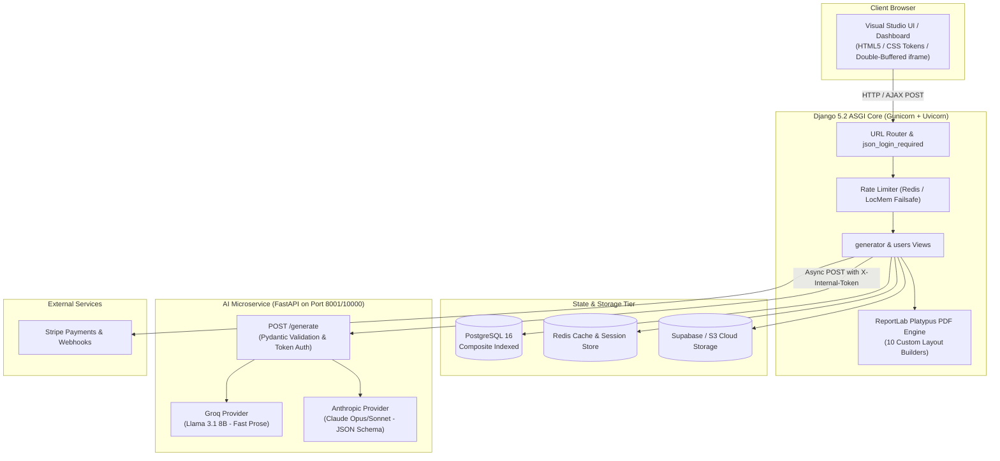

<div align="center">

# 🚀 CVAI — AI-Powered Resume Builder & Career SaaS

[](https://www.djangoproject.com/)
[](https://fastapi.tiangolo.com/)
[](https://www.python.org/)
[](https://www.postgresql.org/)
[](https://redis.io/)
[](https://stripe.com/)
[](https://www.reportlab.com/)
[](https://github.com/ersin2/cvai-saas)

<p align="center">
  A full-cycle SaaS career platform combining interactive A4 PDF resume generation, AI-powered writing assistance, ATS scoring, and job application pipeline tracking.
</p>

[🌐 **Live Demo Website**](https://cvai.work) • [📖 **Documentation**](#-architecture--system-design) • [⚡ **Quickstart**](#-quickstart--local-development) • [🧪 **Testing**](#-testing--quality-assurance)

</div>

---

## 🌟 Key Features

### 🎨 1. Real-Time A4 Visual Resume Studio
* **10 Truly Distinct PDF Templates:** Engineered with ReportLab Platypus (`Minimal Centered`, `Dark Sidebar`, `Hacker Terminal`, `Academic Classic`, `Creative Masonry`, etc.).
* **Zero-Drift Live Preview:** Double-buffered iframe rendering streams actual PDF blobs with debounce and scroll-position preservation.
* **Custom Theming & Typography:** Real-time hex color pickers, font family switching, dynamic spacing, and photo circular masking with memory bounds.
* **Interactive Skills Builder:** Dynamic slider-rated chips with category tabs and bulk-entry parser.

### 🤖 2. Asynchronous AI Career Intelligence
* **Resume Auto-Fill:** Converts raw text or uploaded PDF resumes into structured JSON models via Anthropic Claude structured JSON Schema decoding.
* **Section Rewriter:** Rewrites experience blocks using Google's **XYZ Formula** (*"Accomplished [X] as measured by [Y] by doing [Z]"*).
* **AI Cover Letter Generator:** Tailors multi-format cover letters (Corporate, Bold, ATS Optimized) to specific job descriptions with strict multi-lingual detection.
* **ATS Compatibility & Red-Flag Audit:** Real-time scoring out of 100 with keyword gap analysis and recruiter risk detection.
* **Interview Prep & Follow-Up Generator:** Generates 10 targeted interview Q&As with sample answers and multi-stage recruiter follow-up emails.

### 📋 3. Job Application Kanban Tracker
* **Interactive Pipeline:** Drag-and-drop / select status tracking (`Saved` ➔ `Applied` ➔ `Interview` ➔ `Offer` ➔ `Rejected`).
* **URL Job Scraper:** Auto-extracts clean job descriptions from public job posting links with built-in SSRF protection.
* **Metrics & Analytics:** Consolidated dashboard metrics aggregating conversion rates and active applications.

### 💳 4. Automated Subscription & Monetization
* **Stripe Billing Integration:** Tiered pricing (`Free`, `Pro ($5/mo)`, `Elite ($10/mo)`) with Stripe Checkout sessions and Customer Portal.
* **Webhook Idempotency:** Redis-cached event locks (`cache.add('stripe_evt:<id>')`) preventing replay attacks and duplicate upgrades.
* **Atomic Quota Accounting:** Database-level guarded decrement (`F('generations_count') - 1`) eliminating concurrent free-tier bypasses.
* **GDPR Right-to-Erasure:** Cascading account deletion that auto-cancels active Stripe subscriptions before wiping user records.

---

## 🏛️ Architecture & System Design

The platform uses a **Monolith + Microservice** architecture. Web traffic, authentication, ORM queries, and PDF generation are handled by Django ASGI, while compute-intensive and provider-specific LLM workflows are isolated inside a dedicated FastAPI microservice.



---

## 🛠️ Technology Stack

| Layer | Technology | Purpose |
| :--- | :--- | :--- |
| **Backend Web Core** | [Django 5.2](https://www.djangoproject.com/) + [ASGI](https://asgi.readthedocs.io/) | Web framework, ORM, Auth, Session Management, Security Middleware |
| **Application Server** | [Gunicorn](https://gunicorn.org/) + [Uvicorn Workers](https://www.uvicorn.org/) | Concurrent asynchronous ASGI HTTP worker execution |
| **AI Microservice** | [FastAPI](https://fastapi.tiangolo.com/) | Standalone async LLM gateway with strict Pydantic validation |
| **LLM Inference** | [Anthropic Claude](https://www.anthropic.com/) & [Groq Llama 3.1](https://groq.com/) | High-accuracy structured JSON extraction & low-latency prose generation |
| **Database** | [PostgreSQL 16](https://www.postgresql.org/) / [SQLite](https://www.sqlite.org/) | Relational storage with composite indexes on high-cardinality lookups |
| **Cache & Limiter** | [Redis](https://redis.io/) via `django-redis` | Shared multi-worker rate-limiting, session store, webhook idempotency |
| **Document Engine** | [ReportLab 4.x](https://www.reportlab.com/) + [pdfminer.six](https://pdfminersix.readthedocs.io/) | Low-level Platypus A4 vector PDF generation & PDF text extraction |
| **Media Storage** | [Supabase](https://supabase.com/) / [AWS S3](https://aws.amazon.com/s3/) via `django-storages` | Object storage for avatars and document assets |
| **Payment Gateway** | [Stripe API](https://stripe.com/) | Subscription checkout, billing portal, and webhook handling |
| **Monitoring** | [Sentry SDK](https://sentry.io/) | Performance tracing and real-time exception tracking |

---

## ⚡ Quickstart & Local Development

### Option A: Docker Compose (Recommended)

Run both the Django web server and FastAPI AI microservice in one command:

```bash
# 1. Clone repository
git clone https://github.com/ersin2/cvai-saas.git
cd cvai-saas

# 2. Configure environment
cp .env.example .env

# 3. Build and launch services
docker-compose -f docker-compose.local.yml up --build
```
* Web App: `http://localhost:8000`
* AI Microservice: `http://localhost:8001`

---

### Option B: Manual Setup

#### 1. Prerequisites
* Python 3.12+
* Redis (Optional for local development; LocMem fallback is enabled)

#### 2. Virtual Environment & Dependencies
```bash
# Create and activate virtual environment
python -m venv .venv
source .venv/bin/activate  # On Windows: .venv\Scripts\activate

# Install Django dependencies
pip install -r requirements.txt

# Install AI service dependencies
pip install -r ai_service/requirements-ai.txt
```

#### 3. Database Initialization
```bash
python manage.py migrate
python manage.py createsuperuser
```

#### 4. Run the Development Servers
In two separate terminals:

```bash
# Terminal 1: Run AI Worker
uvicorn ai_service.main:app --host 127.0.0.1 --port 8001 --reload

# Terminal 2: Run Django Web App
python manage.py runserver 127.0.0.1:8000
```

*(On Windows, you can simply run `run_all.bat` to launch both servers automatically).*

---

## 🔑 Environment Configuration (`.env`)

Create a `.env` file in the root directory (refer to `.env.example`):

```ini
# --- Django Core ---
SECRET_KEY=your_django_secret_key_here
DEBUG=True
ALLOWED_HOSTS=localhost,127.0.0.1

# --- AI Microservice & Security ---
AI_SERVICE_URL=http://127.0.0.1:8001
AI_SERVICE_TOKEN=your_internal_shared_token_here
GROQ_API_KEY=your_groq_api_key_here
ANTHROPIC_API_KEY=your_anthropic_api_key_here

# --- Stripe Payments ---
STRIPE_SECRET_KEY=your_stripe_secret_key_here
STRIPE_PUBLISHABLE_KEY=your_stripe_publishable_key_here
STRIPE_WEBHOOK_SECRET=your_stripe_webhook_secret_here
STRIPE_PRICE_ID_PRO=your_stripe_pro_price_id_here
STRIPE_PRICE_ID_ELITE=your_stripe_elite_price_id_here

# --- Optional: S3 / Supabase Storage ---
USE_S3=False
AWS_ACCESS_KEY_ID=your_access_key_id
AWS_SECRET_ACCESS_KEY=your_secret_access_key
AWS_STORAGE_BUCKET_NAME=your_bucket_name
AWS_S3_ENDPOINT_URL=your_s3_endpoint_url

# --- Optional: Error Tracking ---
SENTRY_DSN=
```

---

## 🧪 Testing & Quality Assurance

The test suite provides **98 comprehensive unit & integration tests** covering security guards, PDF generation across all 10 templates, plan gating, and webhook idempotency.

```bash
# Run the entire test suite
python manage.py test tests.test_suite -v 2

# Run Django system checks
python manage.py check
```

### Test Coverage Highlights:
* 🛡️ **SSRF Filter:** Tests against loopback, private IPv4/IPv6, and cloud metadata (`169.254.169.254`).
* 📁 **Upload Security:** Tests magic-byte validation and 5MB limits for PDFs and avatar images.
* 📄 **PDF Engine:** Renders and asserts valid output for all 10 template layouts.
* 🔒 **Auth & Quotas:** Verifies `@login_required`, `json_login_required`, and atomic `use_generation()` decrements.
* 🔑 **Token Authorization:** Verifies `X-Internal-Token` header verification between Django and FastAPI.

---

## 🚀 Production Deployment (Render Blueprint)

The repository includes a production-ready [`render.yaml`](render.yaml) Blueprint configured with:
* Managed PostgreSQL Database (`mysitedb`)
* Managed Redis Cache (`mysite-redis`)
* Web Application (`mysite`) running Gunicorn + Uvicorn ASGI workers with WhiteNoise static compression
* Private AI Worker Service (`ai-worker`) binding internally on port 10000

To deploy on Render:
1. Connect your GitHub repository to Render.
2. Select **Blueprints** and point to `render.yaml`.
3. Set your secret environment variables in the Render Dashboard (`GROQ_API_KEY`, `ANTHROPIC_API_KEY`, `STRIPE_SECRET_KEY`, `STRIPE_WEBHOOK_SECRET`, `AI_SERVICE_TOKEN`).

---

## 📄 License & Credits

Built with ❤️ by [ersin2](https://github.com/ersin2). Distributed under the MIT License.
